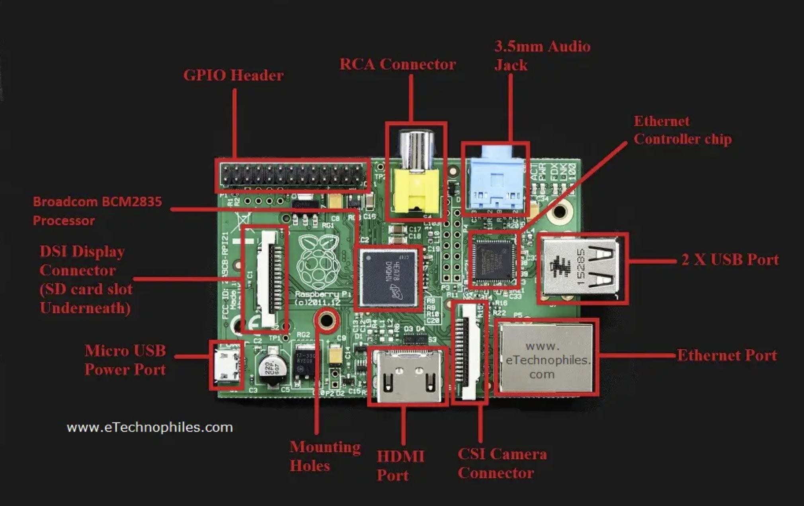

# MultiTubE-RandO

Project to create a raspberry pi 1 device that can play random videos from a USB drive, for the MultiTubE art project

## Pi1 Layout (reference)

## Pi Creation requirements

We're going to set up a Raspberry pi 1 for the purpose of the MultiTubE-RandO application.

You're going to need

- a raspberry pi 1
- a microSD to SD card adapter Or and an SD car reader
- a computer
- a HDMI cable connected to a monitor
- a microUSB cord and power source
- small phillips head screwdriver
- a USB stick
  
## USB Creation steps

1. format the usb stick - FAT32, ExFAT or NTFS
2. copy your videos into the root folder of the usb drive. the videos must be .mp4, h.264 codec, resolution of 1080p or lower. 

## Pi Creation Steps

1. On your computer, download and install the Raspberry Pi imager - <https://www.raspberrypi.com/software/>
2. On your computer, download the videolooper image <https://videolooper.de/video_looper_v2.6.zip> (from <https://videolooper.de/>)

3. Get the micro sd card out of the Raspberry Pi (if necessary)
   1. Open up the case with the screwdriver.
   2. Remove the micro sd card

4. Insert the mircro sd card into your sd card adatper/read and access it from the computer.
5. Make sure the sd card has been formatted (new cards only)
6. Start the Raspberry pi imager application
7. Install the image on the card
   1. Select custom OS -> video looper img file. Make sure you install the sd card from the img file, not from the zip file (in other words - do not forget to unzip)
   2. Select the SD card
   3. Click Write, wait untill finished.
8. Configure the player
   1. Overwrite the video_looper on the root folder of the SD card, OR  
   Open the video_looper.ini file in the root folder of the sd card. change the following settings:
      1. wait_time = 5
      2. set bgimage = /boot/testbeeld.png
      3. is_random = true
      4. duration = 300
      5. path = /boot/video
      6. file_reader = directory
   2. save the file.
   3. copy the file testbeeld.png to the root folder of the sd card.

9. Insert the micro SD card in the pi with an adapters
10. Connect all hardware to the pi - HDMI, micro USB power
11. Do a testrun. Bootup sequence can take a while, and it will prompt you to set up stuff like a network connection. just ignore it and wait.
12. Success!
13. Disconnect all the hardware and put the pi back in it's case (close it back up with the screws).

## Troubleshooting

Some stuff I tried when it did not work
  
- if a usb stick doesnt work, try the other USB port
- some larger USB drives do not work. Try another USB stick.
  
## Read more

<https://videolooper.de/>